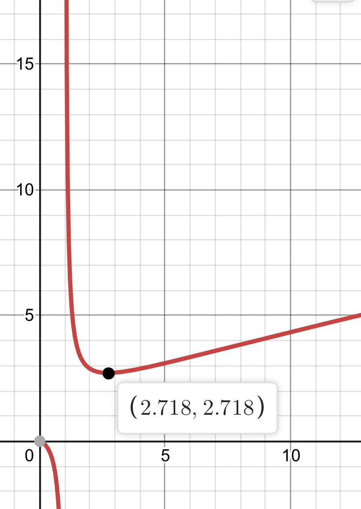

题目来自“ICPC Central Russia Regional Contest (CRRC 19)”，

终于有用高中/大学学到的知识能做的题了。

> ## Description
> While analyzing a mathematical problem, a programmer, Basil by name, noticed an interesting fact: for the numbers $2$ and $4$ holds the equality $2^4=4^2$. 'This could be a great challenge for the participants of the programming championship,' he thought. Unfortunately, Basil could not find other such pairs of numbers, the pair $2$ and $4$ was his only combination that he could think of. 'Okay, then we'll change the conditions, let there be three numbers,' Basil decided. The written program of enumeration options confirmed that with three numbers the task made sense.

> Your task: find the integer $x$ by the given integers $a$ and $b$ such that falls in the range from $1$ to $10^{18}$ (Basil's program didn't deal with greater numbers) such that $a^x=x^b$. If there are several such numbers, type the smaller of them. If such a number does not exist, type $0$.

> ## Input
> The input data consist of two integers $a$ and $b (2\le a,b\le 10000; a\ne b)$, separated by a blank space.

> ## Output
> The integer $x$ if there is a solution, or $0$ (zero) if there is no solution.

## 题目大意
给定 $a,b(1\le a,b\le 10000)$，问是否存在 $x(1\le x\le 10^{18})$，使得 $a^x=x^b$，并输出 $x$。

## 题解
一开始想到的是二次剩余之类的算法，还有数论。

但是既然 $x$ 是唯一的未知数，我们可以把它解出来。

$$
\begin{aligned}
a^x&=x^b\\\
x\ln a&=b\ln x\\\
\frac{x}{\ln x}&=\frac{b}{\ln a}
\end{aligned}
$$

而 $y=\frac x{\ln x}(x\in[1,+\infty))$ 的图像如下：



因为 $x\in[1,+\infty)$，$y=\frac x{\ln x}$ 在 $(1,\mathrm e)$ 减，$(\mathrm e,+\infty)$ 增，若 $x=1$ 或 $x=2$ 满足条件，则优先输出（题目要求多解输出较小的）；同时由于 $a\ne b$，$x\ne 1$。如果没有，就可以在 $[3,+\infty)$ 这个单调区间进行二分找出 $x$。二分的 $\varepsilon=10^{-8}$。

最终的验证环节有一点复杂，一开始想的是最终结果如果与最近的整数相差不超过 $10^{-5}$，$x$ 就是这个整数。但是这样仍然会有精度问题。

最后回到了题目本身，验证 $a^x=x^b$ 即可，用快速幂对 $1000000007$ 取模。如果不放心还可以双哈希。时间复杂度 $O(\log(10^{18}))$。

## Code：
```cpp
#include<iostream>
#include<map>
#include<algorithm>
#include<vector>
#include<queue>
#include<cstring>
#include<cmath>
#include<bitset>
using namespace std;
#define ls (k<<1)
#define rs (k<<1|1)
//#define mid ((l+r)>>1)
#define ll long long
#define eps 1e-7
int gcd(int x,int y)
{
	while(y)
	{
		int t=x%y;
		x=y;
		y=t;
	}
	return x;
}
int cnt[1010];
char s[10010];
const ll p=1000000007;
ll qpow(ll x,ll y)
{
	ll ans=1;
	while(y)
	{
		if(y&1)
			ans=ans*x%p;
		x=x*x%p;
		y>>=1;
	}
	return ans;
}
int main()
{
	int a,b;
	scanf("%d%d",&a,&b);
	if((1ll<<b)==1ll*a*a)
	{
		puts("2");
		return 0;
	}
	double t=b/log(a);
	double l=exp(1),r=1e18;
	while(r-l>1e-8)
	{
		double mid=(l+r)/2;
		double tt=mid/log(mid);
		if(tt<t)
			l=mid;
		else
			r=mid;
	}
	ll i=floor(l+.5);
	if(qpow(a,i)==qpow(i,b))
		printf("%lld\n",i);
	else
		puts("0");
	return 0;
}
 
```